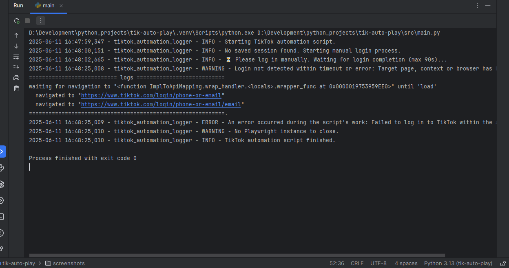

# Tik Auto Play


## Description
A simple Python script that logs into TikTok, searches for videos, and automatically watches or skips them using Playwright.


## Technologies Used
- Python
- Playwright
- Logging
- Pytest


## Features
- Automated TikTok Video Interaction
- Session Management with Authentication
- Robust Logging and Error Handling


## Setup
To install the project locally on your computer, execute the following commands in a terminal:
```bash
git clone https://github.com/Illya-Maznitskiy/tik-auto-play.git
cd tik-auto-play
python -m venv venv
venv\Scripts\activate (on Windows)
source venv/bin/activate (on macOS)
pip install -r requirements.txt
```


## Tests
You can run pytest and flake8 using the following commands:
```bash
pytest
flake8
```


## Run the project
You can customize the search query and other options by editing the src/config.py file.
The results will be saved in the logs directory.
Use the following commands to start the script:
```bash
python -m src.main
```


## Screenshot
### Logging

